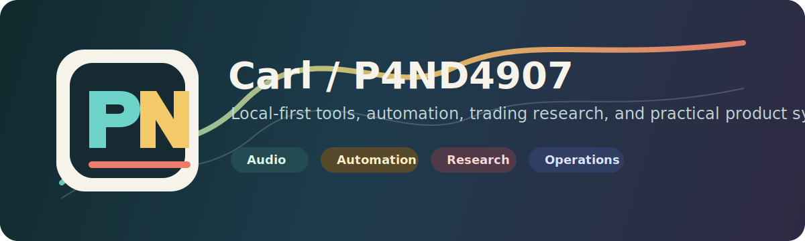

  

#  P4ND4907

I build local-first products, audio tools, trading research systems, and automation dashboards. My favorite projects are practical: they run on a real machine, have safe defaults, show their setup clearly, and keep honest notes about what is finished and what is still experimental.

## Active Labs

| Lab | What I am building | Main repos |
| --- | --- | --- |
| Audio Intelligence | Game-aware audio tools, mic checks, IEM/headphone tuning, hearing-aware EQ, and Equalizer APO workflows. | [CueForge](https://github.com/P4ND4907/cueforge) |
| Trading Research | Paper-first dashboards, replay, risk controls, and market scouting tools. | [Kalshi Scout](https://github.com/P4ND4907/kalshi-scout), [TRADING](https://github.com/P4ND4907/TRADING) |
| Local Ops | Windows helpers, desktop dashboards, private workflow tools, and robot-control utilities. | [Panda Ops](https://github.com/P4ND4907/panda-ops), [Vector](https://github.com/P4ND4907/Vector), [Pandora Desktop](https://github.com/P4ND4907/pandora-desktop) |
| Product Automation | Inbox, service, lead, route, and revenue systems with safer automation defaults. | [InboxPilot AI](https://github.com/P4ND4907/inboxpilot-ai), [YardNow](https://github.com/P4ND4907/yardnow), [Revenue Forge](https://github.com/P4ND4907/revenue-forge) |

## Featured Work

- [CueForge](https://github.com/P4ND4907/cueforge) - local gaming audio lab for self-test, mic feedback, IEM/headphone checks, hearing model experiments, AutoEQ, Audio DNA, and Equalizer APO export.
- [Panda Ops](https://github.com/P4ND4907/panda-ops) - private operations workspace for repeatable checklists, personal systems, and practical automation.
- [Kalshi Scout](https://github.com/P4ND4907/kalshi-scout) - paper-safe prediction-market research dashboard with risk-aware defaults.
- [Northbound Operator](https://github.com/P4ND4907/northbound-operator-site) - service-business web presence and operating system.
- [Revenue Forge](https://github.com/P4ND4907/revenue-forge) - experiments for turning leads, offers, and service workflows into cleaner operating loops.
- [Pandora Desktop](https://github.com/P4ND4907/pandora-desktop) - desktop infrastructure for builds, task graphs, and local tooling.
- [Vector Control Hub](https://github.com/P4ND4907/Vector) - local-first dashboard for controlling and inspecting a Vector robot.
- [InboxPilot AI](https://github.com/P4ND4907/inboxpilot-ai) - Gmail-first AI email operations product.
- [YardNow](https://github.com/P4ND4907/yardnow) - closed-beta route-service app.

## May 24, 2026 Update Rollup

- `release(profile)`: rebuilt this profile repo as the public portfolio hub with a cleaner project map, banner, and asset notes.
- `release(cueforge)`: promoted the audio work under the CueForge name and gave it a dedicated update page.
- `release(ops)`: published update pages for Panda Ops, Pandora Desktop, Vector, and the private workflow utilities.
- `release(research)`: labeled the trading and market dashboards with paper-first status and safer project descriptions.
- `cleanup(archive)`: moved old experiments into an unfinished ledger instead of leaving loose mystery repos around.

## Shipping Rules

1. Keep local-first workflows when hardware, privacy, money, or real-world testing matters.
2. Ship setup notes, screenshots, and self-test paths before calling something finished.
3. Disable destructive, real-money, account-writing, and device-writing behavior by default.
4. Use one strong repo per product line, then park leftovers in [unfinished](https://github.com/P4ND4907/unfinished).

See [PROJECTS.md](PROJECTS.md) for the full catalog.
